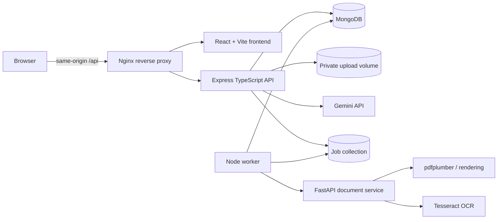

# FormFix AI

> **Tell me what this form actually wants.**

FormFix AI turns a complex PDF form into a structured field checklist. It explains fields in plain language, answers questions using evidence from the form, saves typed answers, checks avoidable mistakes with deterministic rules, and exports a review summary.

This repository contains the connected React frontend, Express/TypeScript API, MongoDB-backed worker, and Python/FastAPI document-processing service.

## Project status

FormFix is a hackathon prototype with one manually verified fictional template: **Sample Student Support Application — Demo Only**. Unknown PDFs can be extracted and inspected, but they are marked `needs_review` and do not receive the sample form's verified rules.

The project does not submit applications, make legal determinations, verify identity documents, authenticate signatures, or fill an official PDF.

## What it does

- Accepts PDF uploads up to 10 MB and 10 pages.
- Validates file extension, MIME type, PDF signature, parsing and encryption status.
- Extracts embedded PDF text and positions before using OCR.
- Renders and OCRs pages without usable text through Tesseract.
- Normalizes source coordinates for page highlighting.
- Matches supported form templates using document identity, anchors, labels and layout checks.
- Explains fields in English, Hindi, Telugu and Marathi.
- Answers grounded questions with source references.
- Saves answers and document-readiness state with revision conflict protection.
- Runs deterministic validation for required values, options, patterns, dates and conditions.
- Exports an authorized JSON review summary.
- Deletes guest sessions and their owned application data.

## Architecture



The browser never receives provider credentials. The API owns sessions, authorization, CSRF protection and validation. OCR runs outside the Node event loop, and document analysis is performed by a leased background job.

## Repository layout

```text
formfix-live/
├── formfix-ai/                  # API, worker, document service and Docker stack
│   ├── apps/api/src/
│   ├── services/document/
│   ├── packages/contracts/
│   ├── fixtures/demo/
│   └── docs/
└── formfix-frontend/            # React frontend and shared UI contracts
    ├── apps/web/
    ├── packages/contracts/
    ├── fixtures/demo/
    └── docs/
```

## Requirements

- Node.js 22 or newer
- Docker Desktop or Docker Engine with Compose v2
- Git
- Python 3.12 and Tesseract only when using the local non-Docker launcher

On Windows PowerShell, use `npm.cmd` if execution policy blocks `npm.ps1`.

## Quick start with Docker

Clone the repository:

```powershell
git clone https://github.com/Akshat-code17/formfix-live.git
Set-Location "formfix-live\formfix-frontend"
```

Install and build the frontend:

```powershell
npm.cmd ci
npm.cmd run build
```

Prepare the backend:

```powershell
Set-Location "..\formfix-ai"
npm.cmd ci
node scripts/init-env.mjs
```

`init-env.mjs` creates `.env` with fresh local secrets and refuses to overwrite an existing file.

Start the complete stack:

```powershell
docker compose -f compose.yaml -f compose.frontend.yaml up -d --build
docker compose -f compose.yaml -f compose.frontend.yaml ps
```

Open [http://localhost:8080](http://localhost:8080).

Stop the stack while preserving MongoDB and upload volumes:

```powershell
docker compose -f compose.yaml -f compose.frontend.yaml down
```

Do not add `-v` unless you intentionally want to delete the persistent Docker volumes.

## AI modes

| Mode | Backend configuration | Behaviour |
|---|---|---|
| Recorded fixture | `DEMO_MODE=true`, `AI_PROVIDER=fixture` | Uses labelled deterministic responses for offline demonstrations |
| Live Gemini | `DEMO_MODE=false`, `AI_PROVIDER=gemini` | Calls Gemini through the server-side provider adapter |

For live Gemini, edit `formfix-ai/.env`:

```env
DEMO_MODE=false
AI_PROVIDER=gemini
GEMINI_API_KEY=your-private-server-side-key
AI_MODEL=gemini-2.5-flash
APP_ORIGIN=http://localhost:8080
```

Recreate the containers after changing environment variables:

```powershell
docker compose -f compose.yaml -f compose.frontend.yaml down
docker compose -f compose.yaml -f compose.frontend.yaml up -d --build --force-recreate
```

Never commit `.env`, upload provider credentials to the frontend, or expose a key through a `VITE_` variable.

## Local connected development

The connected launcher starts Vite, Express, a temporary MongoDB replica set, the worker and FastAPI. It is intended for local synthetic demonstrations and uses recorded AI responses.

```powershell
Set-Location "formfix-frontend"
$env:PYTHON = (Resolve-Path "..\formfix-ai\.venv\Scripts\python.exe").Path
npm.cmd run dev:connected
```

Open [http://localhost:5174](http://localhost:5174). Data in this launcher is temporary; use Docker when data must survive a backend restart.

## Demo flow

1. Open the application and choose **Try a sample form**.
2. Wait for extraction and template matching to finish.
3. Review the fourteen fields across three sections.
4. Open a field explanation and inspect its page evidence.
5. Ask a question about the active field.
6. Enter answers and mark document readiness.
7. Run validation to find the three seeded issues.
8. Correct the issues and revalidate.
9. Download the JSON review summary.

The three intended fixture errors are a five-digit PIN where six digits are required, a missing required supporting-document number, and one required document not marked ready.

## API overview

The API includes:

- `GET /api/config`
- `POST /api/sessions`
- `POST /api/forms/analyze`
- `GET /api/jobs/:jobId`
- `GET /api/forms/:formId`
- `PATCH /api/forms/:formId/answers`
- `PATCH /api/forms/:formId/documents`
- `GET /api/forms/:formId/fields/:fieldId/explanation`
- `POST /api/forms/:formId/ask`
- `POST /api/forms/:formId/validate`
- `GET /api/forms/:formId/export`
- `DELETE /api/sessions/current`

Inputs and outputs are validated against strict shared Zod contracts. See [the API documentation](formfix-ai/docs/api.md) and [generated OpenAPI document](formfix-ai/docs/openapi.json).

## Testing

Backend:

```powershell
Set-Location "formfix-ai"
npm.cmd ci
npm.cmd run build
npm.cmd test
```

Frontend:

```powershell
Set-Location "formfix-frontend"
npm.cmd ci
npm.cmd run build
npm.cmd test
```

Connected browser flow:

```powershell
npx playwright install chromium
npm.cmd run test:connected
```

The test suites cover native PDF extraction, OCR, rotated coordinates, malformed and encrypted PDFs, template rejection, AI response validation, citation validation, deterministic rules, revision conflicts, ownership isolation, deletion and end-to-end corrections.

## Security and privacy

- Guest sessions use opaque identifiers and HttpOnly SameSite cookies.
- Mutations require a CSRF token.
- Every form, job, document and export checks session ownership.
- Uploads use generated private storage names.
- Provider keys stay on the server.
- Logs redact answers, identity data, cookies, keys, file content and chat text.
- Retention defaults to 24 hours and is configurable.
- MongoDB TTL is supplemented by application cleanup for files and related records.
- The document service is private and authenticated.
- PDF links, scripts and embedded files are never executed or fetched.

For public deployment, use HTTPS, persistent private storage, restricted service networking, monitored backups and fresh production secrets.

## Supporting a real form

Uploading an arbitrary PDF does not make it a verified template. Before enabling form-specific checks, review the exact form version and create:

1. Stable field and requirement IDs.
2. Verified source references for every rule.
3. Explicit required, optional and conditional states.
4. Registered deterministic validation rules.
5. Reviewed expected extraction and validation fixtures.

Until that review is complete, the form remains `needs_review` and candidate rules are not treated as authoritative.

## Known limitations

- Only the fictional six-page sample has a manually verified schema and rules.
- Hindi, Telugu and Marathi fixture translations are drafts without documented fluent-speaker review.
- Document readiness is self-reported; uploaded supporting documents are not verified.
- The export is a review summary, not a completed official form.
- No auto-submission, legal determination, identity verification or signature authentication is provided.
- Live Gemini behaviour depends on provider availability, credentials, quotas and applicable data policies.

## Documentation

- [Architecture](formfix-ai/docs/architecture.md)
- [Setup](formfix-ai/docs/setup.md)
- [API reference](formfix-ai/docs/api.md)
- [Provider configuration](formfix-ai/docs/providers.md)
- [Evaluation results](formfix-ai/docs/evaluation.md)
- [Limitations and privacy](formfix-ai/docs/limitations.md)
- [Demo script](formfix-ai/docs/demo-script.md)
- [Frontend/backend connection guide](formfix-frontend/docs/CONNECT_BACKEND.md)

## Disclaimer

FormFix AI is an assistive review prototype. Users must verify all information against the original form and the issuing organization's official instructions before submission.
