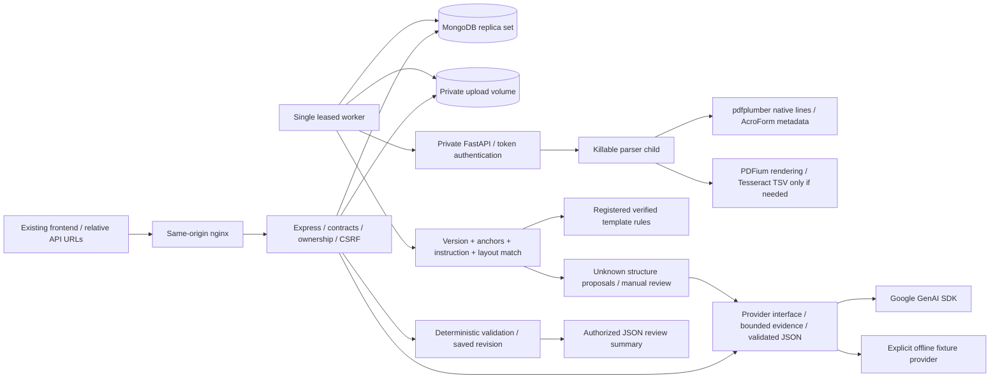

# Architecture

FormFix AI is a one-template backend prototype: a modular Express API, a single Mongo-backed worker using the same application modules, and one private FastAPI document processor. No frontend was present in the supplied workspace. The supplied route/type specification is preserved; `/sources` and the optional `Explanation.fallback` object are additive. No proposal or idea document was present, so neither was used as a target form.

## Data and consistency

`packages/contracts/index.ts` defines strict Zod request/response contracts and exported TypeScript types. Generated JSON Schema and OpenAPI derive from these contracts. Pages are one-based; boxes use displayed page top-left coordinates divided by displayed width/height. Source rectangles are independent of verified answer rectangles. Four rotations are checked against rendered glyph positions and PDF.js viewport transforms. Answers are strings, booleans or null; numeric-looking identifiers remain strings. Readiness is `ready`, `not_ready`, `unknown` or `not_applicable` and never means an attachment was inspected.

Mongo collections: `sessions`, `forms` (including canonical source blocks, answers, readiness and current report), `jobs`, `explanations`, `limits`, and `workerHealth`. Source blocks are embedded in the owned form for atomic deletion, not a separate service. The latest revisioned validation report is persisted; edits remove it. Historic applicant answer snapshots are intentionally not retained.

The single-node replica set is necessary for transactions; a standalone Mongo process is insufficient. Every state mutation/worker commit increments a session fence inside its transaction. Deletion first marks the session inaccessible, cancels internal processing, removes owned PDFs, then transactionally removes records. A worker cannot upsert deleted forms or sessions. Failed cleanup retains the tombstone and returns retryable 503; repeat DELETE with the existing cookie/token. Expired sessions fail authorization immediately. The worker sweeps expiry every 30 seconds between jobs, clears expired generic caches, and removes unowned crash-orphan PDFs older than ten minutes. Session TTL is deliberately omitted: it must not erase the ownership record before file cleanup. Generic caches contain only matched template instruction responses and expire within 24 hours; they contain no answers or chat text.

Jobs are atomically claimed with a random fencing token and 120-second lease, renewed every 30 seconds. Concurrency is one document job per worker; deploy one worker. Expired work is reclaimed once; a second expiration becomes a failed job. `needs_review` means successfully extracted but unsupported/unverified content; parser errors become `failed`. The job's `error.code` distinguishes encryption, parsing, limits and dependency failures. These async failures appear in job status because upload has already returned 202.

## Boundaries

The API checks extension, MIME, magic bytes, size and multipart limits. The private Python service performs actual parsing and page/resource checks. It processes in a child with a wall timeout; Linux child limits include address space, CPU time and open descriptors. OCR subprocesses use argument arrays, English traineddata, a 25-second timeout and TSV output. PDFium rendering is limited to 16 million pixels per page. Only pages with fewer than 40 native text characters use OCR. This heuristic is intentionally conservative and can miss a poor-quality but text-bearing layer.

Template matching checks all six version/page anchors, all 14 printed field labels and rules, all three requirement labels/rules, page aspect ratios, instruction positions and unexpected text outside answer boxes. Matching does not rely on filename or exact PDF hash. Small raster/OCR variations can fail closed to review. This is template recognition, not proof of document authenticity.

Unknown-form AI proposals carry source IDs and explicit unverified constraints. No model-generated code, regex, query or rule is executed. Verified validation uses registered functions and a single restricted `equals` condition operator. No legal or age-eligibility interpretation is inferred.

## Deployment and operation

Only nginx publishes a localhost port. The document service and Mongo are on an internal Docker network. The API/worker need egress for Gemini; the document service has no external network route. Adapters never fetch links from documents. CPU work stays in Python subprocesses. Graceful shutdown stops new jobs and allows the current job to finish; lease recovery handles forced restarts. Mongo transactions, single-worker sizing, volumes and lack of distributed IP-rate-limit evasion protection are documented prototype constraints, not a production readiness claim.

Build progression: contracts and fictional fixture; native extraction/template/source-backed explanation; persisted answers and registered validation; language/chat/export; security, cleanup and measured verification. A real form requires a separately reviewed identity/version, schema, instructions, rules, source mapping and regression corpus before setting `templateVerified=true`.
